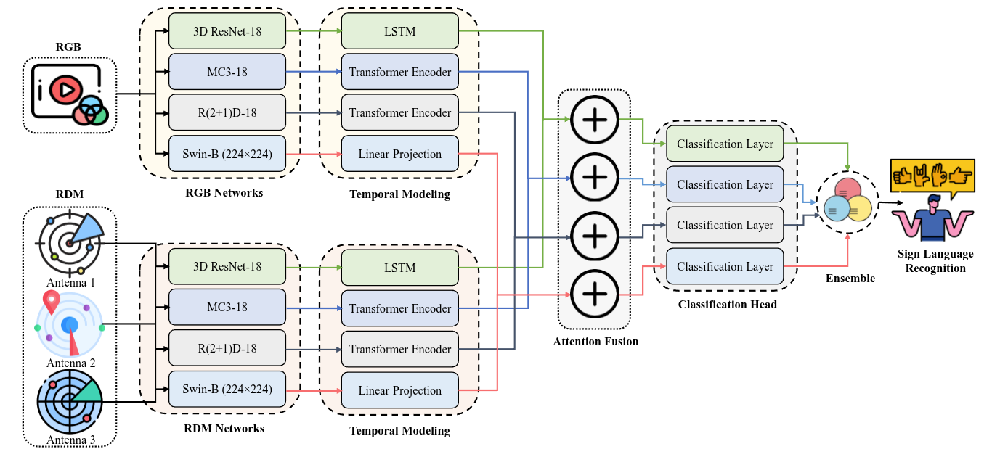

# Multimodal-Isolated-Italian-Sign-Language-Recognition
---
- ***Team Name:*** **CPAMI (UW)**
- **📊 For reference, the best accuracy of our method was `99.365%` on the validation set and `99.444%` on the test set.**
---
---
1st Multimodal Isolated Italian Sign Language Recognition C. using RGB and Radar-RDM Data from the [MultiMeDaLIS Dataset](https://www.kaggle.com/competitions/iccv-mslr-2025-track-2/data) (Mineo et al., 2024). This track presents a sign language recognition task on our multimodal dataset, featuring RGB videos and 60 GHz radar range-Doppler maps, and including 126 Italian Sign Language gestures (100 medical terms + 26 letters) across 205 expert sessions.

## Propossed models Architecture (FusionEnsemble-Net):




*__Figure 1: FusionEnsemble-Net.__ Our proposed hierarchical ensemble architecture for multimodal isolated sign language recognition. The model comprises three major stages:  **Multimodal Feature Extraction**: Parallel spatiotemporal networks retrieve high-level features by processing RGB and RDM data with four different networks and temporal modeling layers. **Attention Fusion**: Feature representations are dynamically combined via an attention mechanism that fuses information across multiple modalities. **Ensemble Classification**: The four resulting feature vectors are input to independent classifiers, whose predictions are aggregated to provide a final sign language recognition output.*

---

## Running the Model

```
python train.py 
```

## Generating the submission file

```
python submission.py 
```

## Result Overview:
### Model Performance Results

Here are the performance metrics for various models, including individual architectures and an ensemble approach.

| Model                       | Validation Acc | Test Acc |
|-----------------------------|----------------|----------|
| TwoStreamCNNLSTM            | 0.96575        | 0.96575  |
| AdvancedTwoStreamModel      |                |          |
| &nbsp;&nbsp;&nbsp;&nbsp;- Run 1 | 0.98594        | 0.98594  |
| &nbsp;&nbsp;&nbsp;&nbsp;- Run 2 | 0.98752        | 0.99126  |
| &nbsp;&nbsp;&nbsp;&nbsp;- Run 3 | 0.98662        | 0.98994  |
| &nbsp;&nbsp;&nbsp;&nbsp;- Run 4 | 0.98956        | 0.99060  |
| UltraAdvancedTwoStreamModel | 0.96938        | 0.97341  |
| SwinTwoStreamModel          | 0.94240        | 0.94417  |
| **Ensemble All Model** | **0.99365** | **0.99444** |

**Note:** The ensemble model combines TwoStreamCNNLSTM, AdvancedTwoStreamModel, UltraAdvancedTwoStreamModel, and SwinTwoStreamModel.